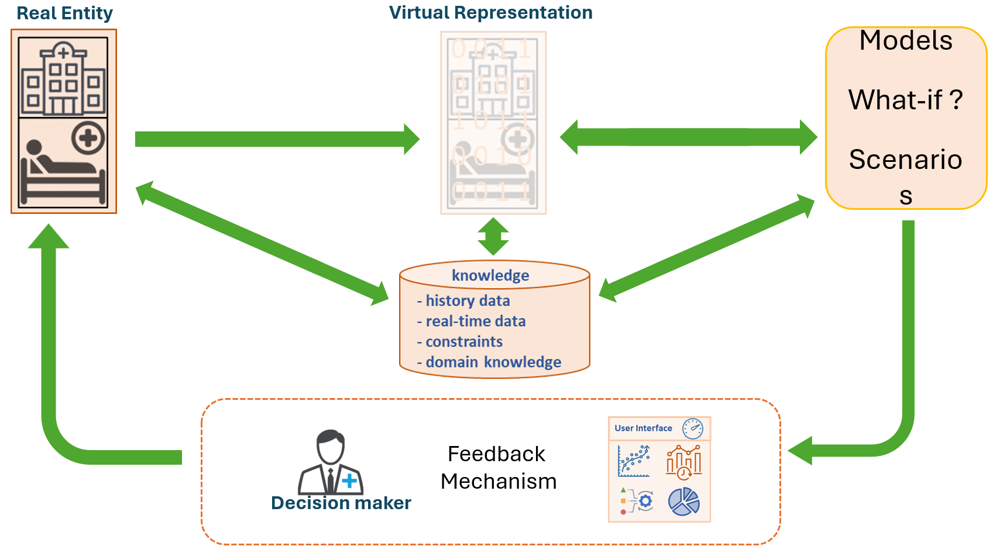

# Digital Twin: exploration (v1)

In this repo we explore very basic concepts of a digital twin as discussed in [1]. Specifically, this example will walk thru and implement all the stages (green arrows) shown in the proposed universal digital twin framework.

 

 

Each section walks the user thru a series of steps to :

1. Analyse and understand the system we wish to twin (Red Dot)
2. Create a digital twin (Blue Dot) based on historical information from orginal entity
3. Continue to monitor original entity while updating parameters for digital twin
4. While step 3 is ongoing, explore several what-if scenarios and test on digital twin 

## 1. Background: Original system called Red Dot

We observe the x and y coordinates from the original system called Red Dot within the unit square. Red Dot is the original entity we wish to better understand via a digital twin, so we must first know a little about Red Dot and look at its historical records.

To get some sense on the basic parameters of the ditigal twin to be created, we first analyse historical data on Red Dot. This was collected hourly, over 24 hours, for 30 days. There is sufficient information for us to incorporate analytical (statistical and/or mathematical) models to get a sense on Red Dot's behaviour.  

See `2_Initialise_DT.R` script for initial analyses on Red Dot's historical data to initialise our digital twin. 

__What is Red Dot doing?__

From this we infer that Red Dot appears to move randomly every hour approximately within the square and this is deemed normal operation. There are instances where Red Dot diverges from normal operation and "gets stuck" in one of the corners of the unit square.

Below is an animation of Red Dot for the entire historical period (30 days)

 

__How does Red Dot fit in the digital twin framework?__

Red Dot = Real Entity

 

_Script index_

`0_create_original_system.R` generates the historical data on Red Dot and generates animation/ visualisation of Red Dot. This is saved in `OriginalData.csv` file and `RedDot_historial.gif`.

`1_ongoing_data_from_original_system.R` generates daily data for the 20 days of Red Dots behaviour, saved in `dat_X_data.csv` files.

 
 

## 2. The digital twin: Blue Dot

Now that we know the basic parameters/ behaviour of Red Dot, we create a digital twin named Blue Dot which mimics the behaviour of Red Dot in script `2_initialise_DT.R`. As Red Dot is in a unit square and remains so across all historical data and for current day analysed, then Blue Dot follows similar pattern based on analyses of Red Dots historical data, such as the plot below.

The x and y coordinates of Blue Dot over time are based on Red Dots behaviour.

 
After the initial historical data available on Red Dot, let's assume we receive coordinates of Red Dot on an ongoing basis every hour, for 24 hours every day and this information is stored in the respective `day_X_data.csv` file. This daily operation runs for 20 days total, so we assume that each day we get access to Red Dot's daily coordinates. 

See script `3_update_DT.R` for Blue Dot being updated daily. 

See script `4_monitor_original_system.R` for ongoing monitoring and analyses of Red Dot.

__What is Blue Dot doing?__

In a nutshell, we want Blue Dot to mimic Red Dot. If Red Dot continues to randomly explore an approximate unit square, then Blue Dot will do so too. If Red Dot gets stuck somewhere in the unit square, then with some probability, Blue Dot will do the same.

Below is an animation of Blue Dot after being initialised by historial Red Dot data.
** insert gif**

Below is an animation of Red Dot (for a given day) and Blue Dot for a simulated day 

** insert gif**

 
__How does Blue Dot fit in the ditigal twin framework?__

 

_Script index_

`2_initialise_DT.R`

`3_update_DT.R`

`4_monitor_original_system.R`

 
 

## 3. Ongoing feedback between Red and Blue dots and information derived

 
 

## 4. Explore what-if scenarios on Blue Dot

 
 

## References

[1] Riahi, V., Diouf, I., Khanna, S., Boyle, J., Hassanzadeh, H., _Digital Twins for Clinical and Operational Decision Making: a Scoping Review_, 2023, DOI:10.2196/preprints.55015, available https://www.researchgate.net/publication/376167195_Digital_Twins_for_Clinical_and_Operational_Decision-Making_a_Scoping_Review_Preprint
